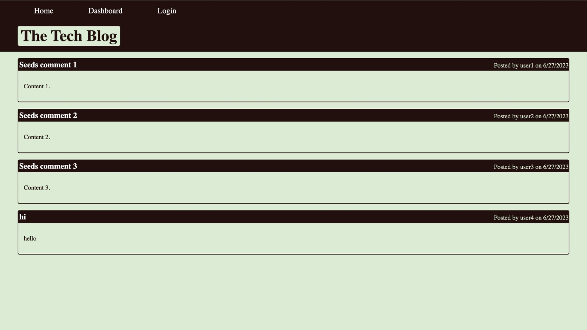
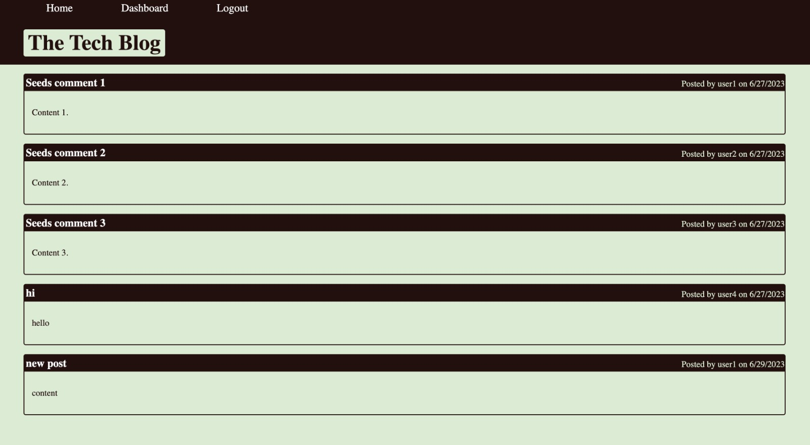
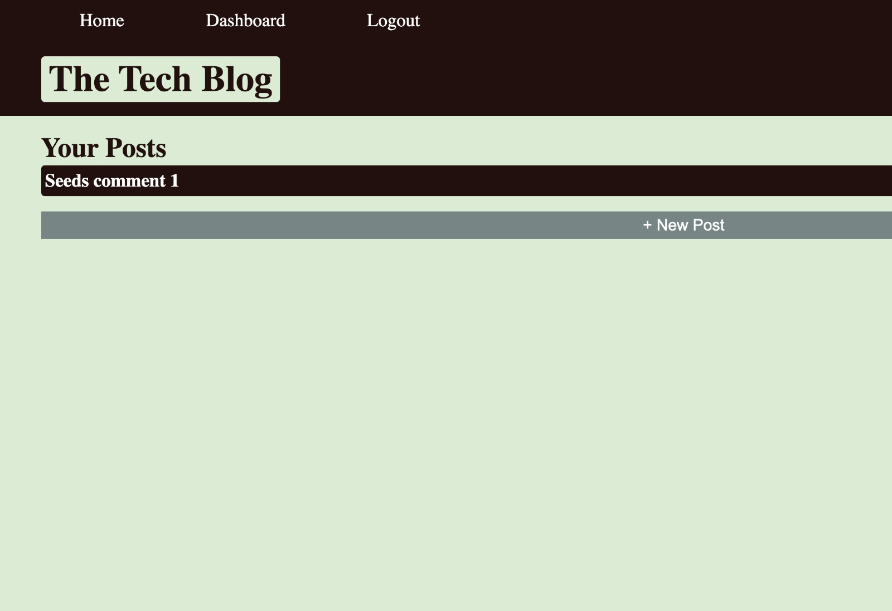
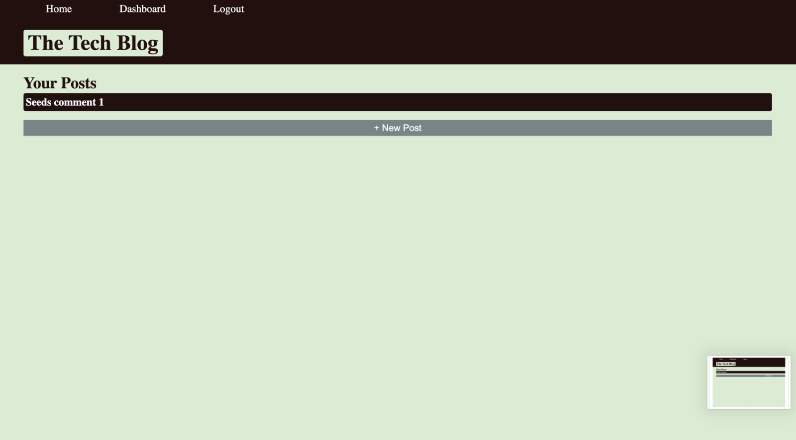
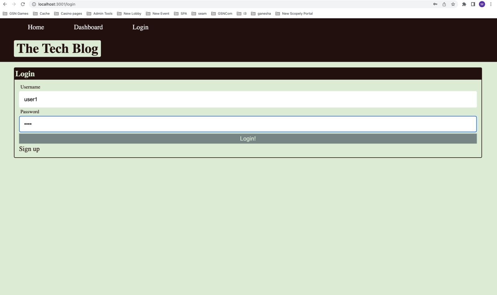
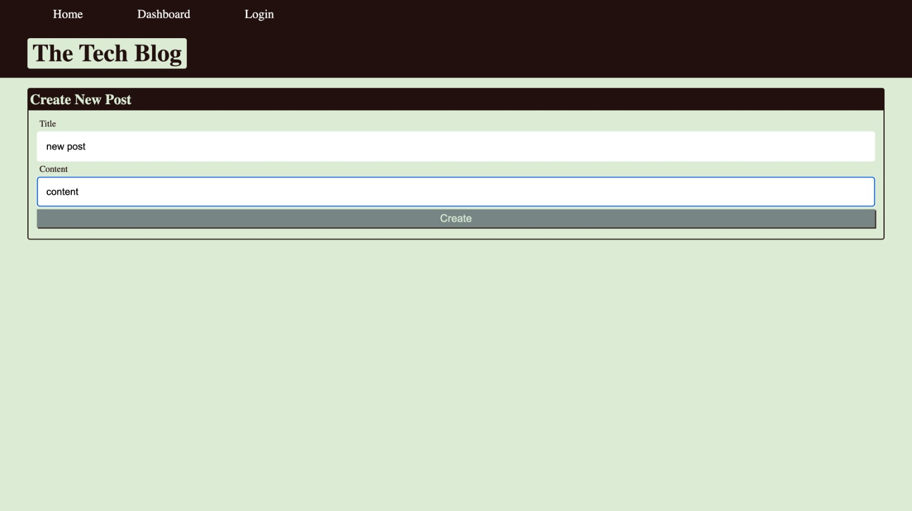

# CMS-STYLEBLOGSITE

## Project Description

This application is a CMS-style blog site similar to a Wordpress site, where developers can publish their blog posts and comment on other developers’ posts as well

## Techstack

Node JS.
Express JS.
MySQL2.
Sequelize.
dotenv.
express-handlebars
express-session
bcrypt

## Screenshots of app running on localhost

## Heroku deployed app url

https://cms-blog-node-vijay-7c09480588f2.herokuapp.com/

## Project Installation

To install the project follow below steps.

1. Download the project or clone this repository using git clone
2. Open terminal and run the command 'npm install'
3. Edit below variables in .env filr in the root directory of the app
    DB_NAME='cms'
    DB_USER='root'
    DB_PASSWORD='password'
4. Start Mysql in your mac
5. Copy queries from schema.sql file and run them on your mysql db or run 'source db/schema.sql'
6. Open terminal and run the command 'npm run seeds'
7. In terminal run the command 'npm start'

## Usage

1. Run the command 'npm start' to run the application in terminal.
2. Open app in http://localhost:3001

## Testing
 No Test cases specified.

 ### Reach me here: 
 
 Have Queries? Reach me at
 Email : vijay.cheruku@live.com